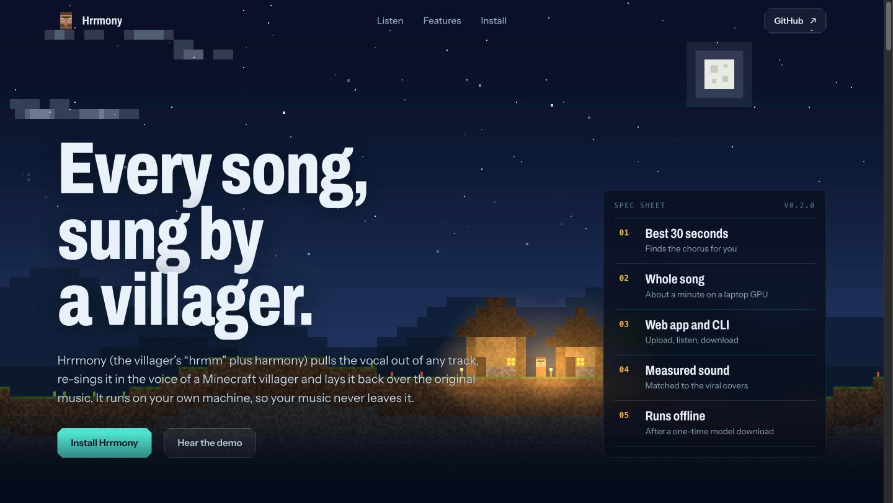
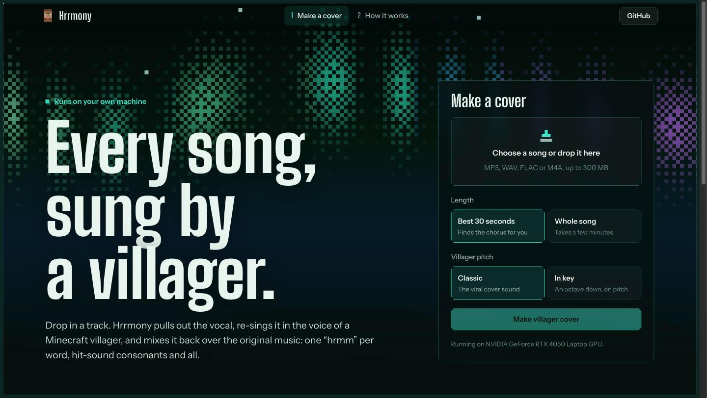

<p align="center">
  <a href="https://kenny2077.github.io/hrrmony/"></a>
</p>

<h1 align="center">Hrrmony</h1>

<p align="center"><b>Every song, sung by a Minecraft villager.</b><br>
<i>Hrrmony</i> = the villager's “hrmm” + harmony.<br>
Drop in a track and get back a villager cover, made locally on your own machine: one “hrmm” per word, hit-sound consonants and all.</p>

<p align="center"><a href="https://kenny2077.github.io/hrrmony/#listen"><b>▶ Hear the demo</b></a> &nbsp;|&nbsp; <a href="https://kenny2077.github.io/hrrmony/">Product page</a> &nbsp;|&nbsp; <a href="docs/how-it-works.md">How it works</a> &nbsp;|&nbsp; <a href="https://github.com/kenny2077/hrrmony/releases">Releases</a> &nbsp;|&nbsp; An <a href="https://auroraforgelab.com/">Aurora Forge Lab</a> product</p>

<p align="center">
  <a href="https://github.com/kenny2077/hrrmony/actions/workflows/ci.yml"></a>
  <a href="LICENSE"></a>
  
  
</p>

---

## Features

<table>
<tr><td><b>Two ways to cover</b></td><td>The best 30 seconds, with the chorus found automatically, or the whole song.</td></tr>
<tr><td><b>Sounds like the viral covers</b></td><td>The recipe is reverse-engineered and measured against a popular AI villager cover, not guessed. See <a href="docs/how-it-works.md">how it works</a>.</td></tr>
<tr><td><b>Keeps the song recognisable</b></td><td>The original instrumental stays as it is. The villager follows the singer's own pitch, timing and phrasing.</td></tr>
<tr><td><b>Web app and CLI</b></td><td>A local web app with live progress and side-by-side playback, or one command in a terminal or script.</td></tr>
<tr><td><b>Fast on a laptop GPU</b></td><td>About 25 s for a 30-second cover on an RTX 4050. CPU works too, just slower.</td></tr>
<tr><td><b>Private and offline</b></td><td>Your music never leaves your machine. Models are downloaded once, pinned to exact versions, and cached; after that it runs without internet.</td></tr>
</table>

## Requirements

| | Minimum | Tested |
|---|---|---|
| GPU | optional (CPU works, several times slower) | NVIDIA RTX 4050 Laptop, 6 GB |
| RAM | 8 GB | 32 GB |
| Disk | about 1.5 GB for models | |
| Software | Python 3.10–3.12, [ffmpeg](docs/faq.md) | Ubuntu 22.04 (WSL2), Python 3.10, CUDA |

## Quick install

```bash
pip install "hrrmony[gpu,web] @ git+https://github.com/kenny2077/hrrmony"   # NVIDIA GPU
pip install "hrrmony[cpu,web] @ git+https://github.com/kenny2077/hrrmony"   # CPU only / macOS
hrrmony doctor
```

Or with Docker (NVIDIA Container Toolkit):

```bash
git clone https://github.com/kenny2077/hrrmony && cd hrrmony
docker compose up --build      # then open http://127.0.0.1:7860
```

## Getting started

```bash
hrrmony serve                                   # web app at http://127.0.0.1:7860
hrrmony cover song.mp3                          # best 30 s (chorus), "classic" villager sound
hrrmony cover song.mp3 --full                   # the entire song
hrrmony cover song.mp3 --shift in-key           # an octave down, in tune with the music
hrrmony cover song.mp3 --start 43 -d 20         # pick the excerpt yourself
hrrmony cover song.mp3 --stems -o covers/       # also save villager vocal + instrumental
hrrmony voices --download villager              # pre-fetch models (~1.2 GB, once)
hrrmony doctor                                  # check ffmpeg, CUDA and the cache
```

Each cover writes `<song>_villager_<start>s.mp3` and `.wav`, plus a loudness-matched `…_original.mp3` of the same excerpt for A/B listening.

### Web app



`hrrmony serve` starts a local web app. Drop in a song, choose the best 30 seconds or the whole song and the villager pitch, follow the progress live, then play the cover next to the original and download MP3 or WAV.

### From Python

```python
from hrrmony import CoverOptions, make_cover

result = make_cover("song.mp3", "covers/", CoverOptions(mode="hook", shift=-8))
print(result.outputs["mp3"], result.start, result.timings["total"])
```

## How it works

```
song ─▶ find the hook ─▶ separate vocal ─▶ RVC villager voice ─▶ EQ + mix ─▶ master (−16 LUFS)
        (or whole song)   Mel-Band RoFormer   −8 st "classic" /     dry, mono,
                                              −12 st "in key"       −3.9 dB under the music
```

The popular villager covers turned out not to be villager clips pasted onto notes. They are the singer's own vocal re-voiced by a model trained on villager sounds. That is why the phrasing stays human and the consonants come out as villager *hurt* noises.

[docs/how-it-works.md](docs/how-it-works.md) has every measurement behind the settings. [research/](research/) has the experiment log and the scripts.

### Tested results (RTX 4050)

| Input | Mode | Result | Time |
|---|---|---|---|
| Jingle Bells chorus (public domain, synthetic singer) | 30 s, `classic` and `in-key` | all 51 notes sung, 98% within 50 cents of the melody | 21 s / 10 s |
| 凉凉 | 30 s, hook auto-found at 91.5 s (chorus starts at 90.3 s) | | 25 s |
| Shape of You | `--full`, 4 min 23 s | the cover has the same length as the song | 75 s |
| Never Gonna Give You Up | 30 s at 29.5 s | matches the reference AI cover: 50 vs 50 syllables, same hit-like consonant bursts | ~30 s |

Copyrighted songs were used only for private testing. The public demo uses a public-domain melody.

## Documentation

| Page | What's covered |
|---|---|
| [How it works](docs/how-it-works.md) | Pipeline, the reverse-engineered recipe, the hook finder, performance |
| [Configuration](docs/configuration.md) | CLI options, environment variables, cache layout |
| [FAQ and troubleshooting](docs/faq.md) | ffmpeg, CUDA, model downloads, off-key results, rights |
| [Research log](research/README.md) | Five iterations from pasted clips to voice conversion |

## Security and privacy

- **Pinned, non-executable models.** Every model download is pinned to an exact Hugging Face commit. The RVC and pitch checkpoints are loaded with `weights_only=True`, and the speech encoder is safetensors, so a tampered checkpoint can't run code.
- **Local-only web app.** It binds to `127.0.0.1` by default, refuses foreign `Host` headers (DNS rebinding) and cross-origin posts, caps the queue at 8 covers, and deletes uploads after 24 hours.

See [SECURITY.md](SECURITY.md) for how to report a problem.

## Status and roadmap

- **Verified end to end:** Linux and NVIDIA CUDA, for both the CLI and the web app (tests include a full GPU run).
- **Not yet verified end to end:** the macOS and CPU-only paths, and the Docker image. Reports are welcome.
- **Next:**
  - more voices (wandering trader, illagers)
  - an own-trained villager voice with a clear licence
  - a learned song-structure model for picking the hook
  - the Minecraft look of the product page brought to the web app

## Responsible use

- Covers of copyrighted songs are derivative works. Make sure you have the right to use the song before you publish anything.
- The default voice is a community RVC model ([r3gm/villager](https://huggingface.co/r3gm/villager)), downloaded at runtime. It is not part of this repository, so check its terms.
- Hrrmony is a fan project. It is not affiliated with Mojang Studios or Microsoft. Minecraft is a trademark of Mojang Studios.

## Contributing

Issues and PRs are welcome. Start with [CONTRIBUTING.md](CONTRIBUTING.md): setup, tests, and the Conventional Commits we use. Report security problems privately, as described in [SECURITY.md](SECURITY.md).

---

MIT, see [LICENSE](LICENSE). Includes vendored [infer_rvc_python](https://github.com/R3gm/infer_rvc_python) (MIT).
